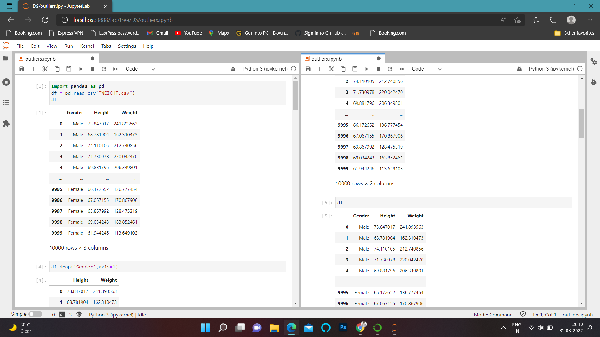
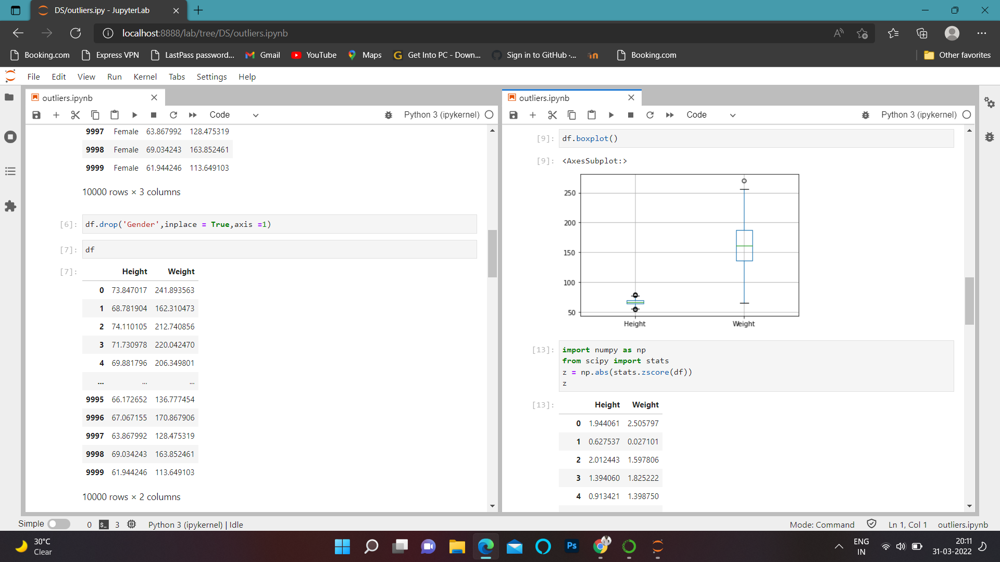
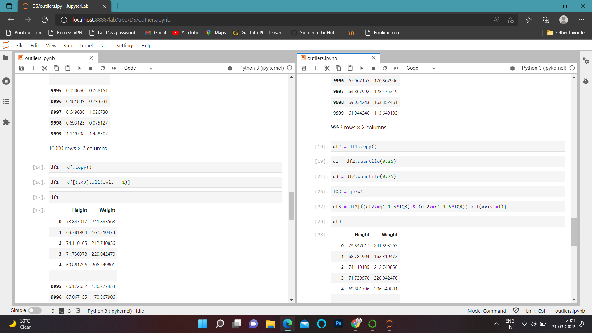
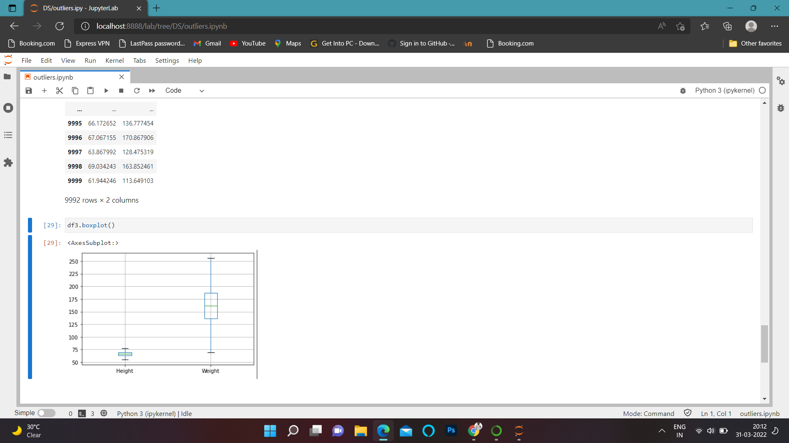

# Ex - 02_DS_Outlier

## Aim : To detect and remove the outliers from the given csv file.

### Step 1 : Create a new file in jupyter notebook.
### Step 2 : Upload the given csv file.
### Step 3 : Open the csv file.
### Step 4 : Write codes for outliers detection and removal operation.
### Step 5 : Use quantile formulas and boxplot.
### Step 6 : End the program.

## Program :
~~~

import pandas as pd
df = pd.read_csv("WEIGHT.csv")
df
df.drop('Gender',axis=1)
df
df.drop('Gender',inplace = True,axis =1)
df
df.boxplot()
import numpy as np
from scipy import stats
z = np.abs(stats.zscore(df))
z
df1 = df.copy()
df1 = df[(z<3).all(axis = 1)]
df1
df2 = df1.copy()
q1 = df2.quantile(0.25)
q3 = df2.quantile(0.75)
IQR = q3-q1
df3 = df2[((df2>=q1-1.5*IQR) & (df2>=q1-1.5*IQR)).all(axis =1)]
df3
df3.boxplot()

~~~

## Output :

# Result:
Thus the outliers is detected and removed.
